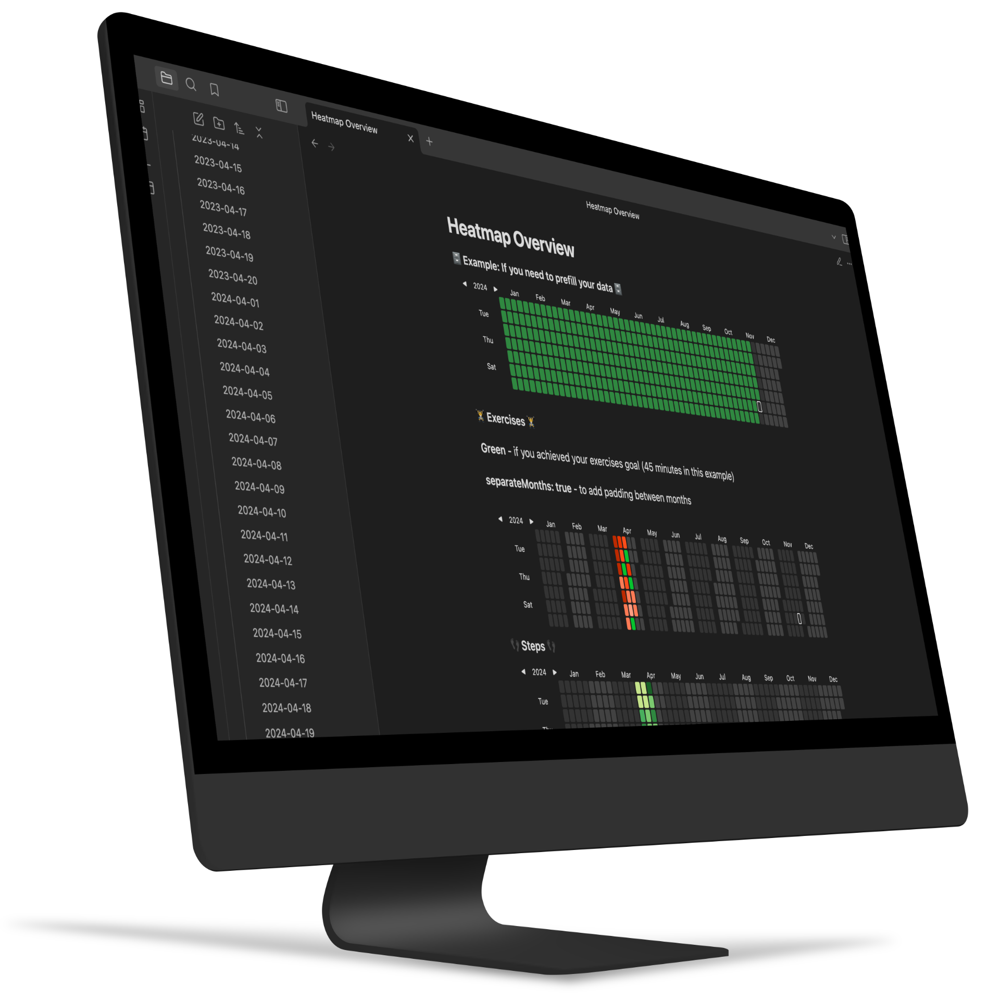
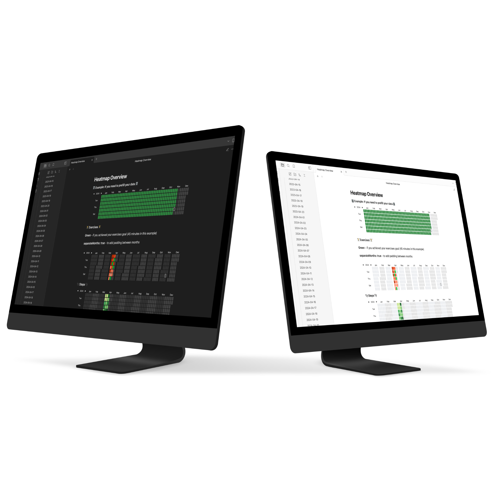

# Heatmap Tracker plugin for Obsidian

Visualize your data in a heatmap tracker similar to the github activity tracker using this [Obsidian](https://obsidian.md/) plugin.


This plugin is useful for tracking progress for exercise, finances, social time, project progression, passions, learning progress and so on.   

To be used with [Obsidian Dataview](https://blacksmithgu.github.io/obsidian-dataview/), but could be used standalone or with other plugins as well (if you know some javascript).

<p>
    <picture>
      <source media="(prefers-color-scheme: dark)" srcset="https://github.com/mokkiebear/heatmap-tracker-obsidian/blob/main/public/preview.gif?raw=true">
      <source media="(prefers-color-scheme: light)" srcset="https://github.com/mokkiebear/heatmap-tracker-obsidian/blob/main/public/preview.gif?raw=true">
      
    </picture>
</p>




&nbsp;
## How to

1. Annotate the data you want to track in your daily notes (see [Dataview annotation documentation](https://blacksmithgu.github.io/obsidian-dataview/data-annotation/)) 

2. Create a [DataviewJS block](https://blacksmithgu.github.io/obsidian-dataview/api/intro/) where you want the Heatmap Tracker to display.  

3. Collect the data you want to display using [DataviewJS](https://blacksmithgu.github.io/obsidian-dataview/api/code-reference/)

4. Pass the data into Heatmap Tracker using  **renderHeatmapTracker()** 

&nbsp;

*Visualized Concept:*


## Full Example Code:

~~~javascript
\```dataviewjs // PS. remove backslash \ at the very beginning!

dv.span("** 😊 Title  😥**") /* optional ⏹️💤⚡⚠🧩↑↓⏳📔💾📁📝🔄📝🔀⌨️🕸️📅🔍✨ */
const trackerData = {
	year: 2022,  // (optional) defaults to current year
	colors: {    // (optional) defaults to green
		blue:        ["#8cb9ff", "#69a3ff", "#428bff", "#1872ff", "#0058e2"], // first entry is considered default if supplied
		green:       ["#c6e48b", "#7bc96f", "#49af5d", "#2e8840", "#196127"],
		red:         ["#ff9e82", "#ff7b55", "#ff4d1a", "#e73400", "#bd2a00"],
		orange:      ["#ffa244", "#fd7f00", "#dd6f00", "#bf6000", "#9b4e00"],
		pink:        ["#ff96cb", "#ff70b8", "#ff3a9d", "#ee0077", "#c30062"],
		orangeToRed: ["#ffdf04", "#ffbe04", "#ff9a03", "#ff6d02", "#ff2c01"]
	},
	showCurrentDayBorder: true, // (optional) defaults to true
	defaultEntryIntensity: 4,   // (optional) defaults to 4
	intensityScaleStart: 10,    // (optional) defaults to lowest value passed to entries.intensity
	intensityScaleEnd: 100,     // (optional) defaults to highest value passed to entries.intensity
	entries: [],                // (required) populated in the DataviewJS loop below
}

//DataviewJS loop
for (let page of dv.pages('"daily notes"').where(p => p.exercise)) {
	//dv.span("<br>" + page.file.name) // uncomment for troubleshooting
	trackerData.entries.push({
		date: page.file.name,     // (required) Format YYYY-MM-DD
		intensity: page.exercise, // (required) the data you want to track, will map color intensities automatically
		content: "🏋️",           // (optional) Add text to the date cell
		color: "orange",          // (optional) Reference from *trackerData.colors*. If no color is supplied; colors[0] is used
	})
}

renderHeatmapTracker(this.container, trackerData)

```
~~~
 

&nbsp;

## Colors:

The heatmap uses a green color scheme by default, just like Github.


**Default Color: green (no color specified)**


&nbsp;


**Custom Color**

You can customize the colors of the heatmap by supplying a color array to **trackerData.colors**:


&nbsp;

<details>
<summary>More color options</summary>

&nbsp;

<b>Multi-Color:</b>

You can use multiple colors to display different data-entries in the same heatmap.
Specifying the name you gave the color in trackerData.colors (eg. "blue", "pink" etc).


<b>Styling Background (empty days):</b>

Use Obsidian's built in "CSS snippets" for custom styling including styling the empty days (aka the background cells).  

But remember this will affect all of you heatmaps in all of your notes.


<b>Global color schemes via settings:</b>

You can also add a color scheme via the Settings panel. This scheme which will be available everywhere.

In order to do so go to `Obsidian Settings > Heatmap Tracker`, you will see a list of available colors, and you can add your own. You must specify a “Color name” by which you will reference it in your render call, and provide a valid array of colors.

When you do so, you can now reference your scheme everywhere by passing your name to the `colors` option. For example, let's say you have defined a new color called `githubGreen`. Now, in your code, you can reference it like so:

~~~javascript
```dataviewjs
const trackerData = {
	colors: "githubGreen",
	entries: [],
}

renderHeatmapTracker(this.container, trackerData)
```
~~~

&nbsp;

&nbsp;


<i>The color schemes used in the examples were created at [leonardocolor.io](https://leonardocolor.io).</i>
<br>

---

</details>


&nbsp;


## Data Intensity:
Set which intensity of color to use (eg. from light-green to dark-green etc).


<details>
<summary>More</summary>
<br>
They color-range will be distributed between the highest and lowest number you pass to "intensity".

If the number range 0-100 is used, numbers between 1-20 would map to the lightest color, 40-60 would map to mid intensity color, and 80-100 would map to max intensity.
You can add more intensities in order to increase color resolution; simply supply more colors to <b>trackerData.colors.yourcolor</b>

Dataview's time variables are supported without any conversion, as they return milliseconds by default.  
<b>[time:: 1 hours, 35 minutes] => intensity: page.time</b>


</details>


&nbsp;

--- 


## Other Notes:
- See the [EXAMPLE VAULT](https://github.com/Richardsl/heatmap-tracker-obsidian/tree/master/EXAMPLE_VAULT) if you want to test out the examples.
- Week start day is configurable
- Date format is YYYY-MM-DD, if your daily note filename is something else, [you can use JS to change it in the loop](https://github.com/Richardsl/heatmap-tracker-obsidian/discussions/2)
- Use Obsidian CSS snippets for custom styling. See [snippet examples](https://github.com/Richardsl/heatmap-tracker-obsidian/tree/master/EXAMPLE_VAULT/.obsidian/snippets).

&nbsp;

## Development (Windows/Mac):

 ```npm run dev``` - will start an automatic TS to JS transpiler and automatically copy the generated JS/CSS/manifest files to the example vault when modified (Remember to run ```npm install``` first).

 After the files have been transpiled, the **hot-reload plugin** (https://github.com/pjeby/hot-reload) then reloads Obsidian automatically.
 Hot-reload is installed in the example vault by default. its used to avoid restarting obsidian after every change to code.  
 *(remember to add an empty *.hotreload* file to "EXAMPLE_VAULT/.obsidian/plugins/heatmap-tracker/" if not already present, as this tells hot-reload to watch for changes)*


```npm run build``` generates the files ready for distribution.

&nbsp;

Tip: ```ctrl-shift-i``` opens the devtools inside Obsidian.

&nbsp;


## Technical Explanation
All the plugin does, is add the function ***renderHeatmapTracker()*** to the global namespace of you vault.

**"this.container"** is passed as the first argument because the plugin needs to know where to render the tracker. You don't have to worry about this.

"renderHeatmapTracker()" then takes **"trackerData"** as the secondary argument. This is the javascript object you have to create yourself in order to give plugin instructions and data. Most of the properties are optional, but you have to supply an entries array as an absolute minimum.  

See the beginning of the readme for the full code example.

**absolute minimum code example:**
~~~javascript
\```dataviewjs

const trackerData = {
    entries: [],                
}

renderHeatmapTracker(this.container, trackerData)

```
~~~


&nbsp;


&nbsp;
<br>
---

### What's New:
<br>

**Version [1.0.0] - 2024-1-22**
<details>
<summary>Add pages for heatmap</summary>
Initial implementation of heatmap for obsidian.
<br>

</details>
